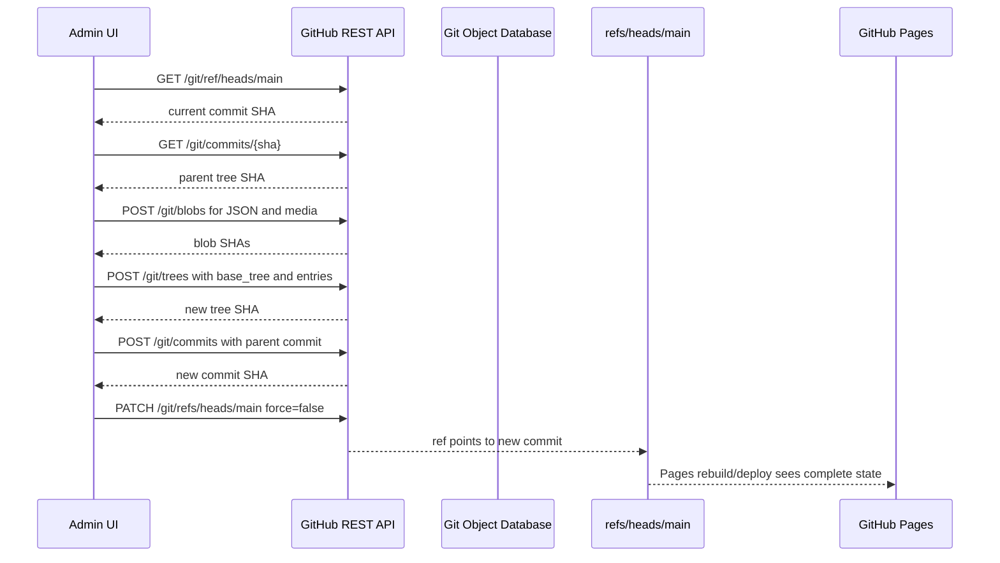

# Детальний документ проєкту

Оновлено: 2026-06-12

## 1. Назва та короткий опис

Робоча назва: **Open Jamstack Portfolio**.

Проєкт є відкритим Jamstack-редактором персонального портфоліо. Він поєднує:

- публічну сторінку портфоліо;
- адмін-панель для редагування даних;
- JSON як головне джерело контенту;
- GitHub Pages як безсерверний хостинг;
- GitHub API як механізм запису змін у репозиторій.

Ключова ідея цільової архітектури: публікація має бути атомарною за принципом "все або нічого". Дані портфоліо та медіафайли повинні потрапляти в історію одним спільним комітом. Сайт має побачити зміни лише після успішного завершення всього ланцюжка.

## 2. Проблема, яку вирішує система

Звичайне портфоліо на GitHub Pages часто має одну з двох крайностей:

- статичний сайт без зручного редагування;
- CMS із сервером, базою даних і додатковою інфраструктурою.

Цей проєкт шукає середній шлях: портфоліо залишається простим статичним сайтом, але власник може редагувати його через браузер. Репозиторій GitHub виступає джерелом істини, а GitHub Pages публікує результат.

Особлива увага приділена медіафайлам. Якщо зображення завантажується окремо від JSON, можливий неконсистентний стан: файл уже збережений, але JSON не оновився, або JSON посилається на файл, який не був успішно доданий. Для портфоліо це критично, бо рекрутер або клієнт може побачити зламану сторінку.

## 3. Продуктова цінність

Система має дати власнику портфоліо такі можливості:

- швидко змінювати ім'я, спеціалізацію, локацію, опис і контакти;
- додавати або змінювати avatar та інші майбутні медіа;
- показувати відео через YouTube/Vimeo links;
- показувати 3D-моделі як `.glb` assets з Draco-стисненням;
- демонструвати не лише фінальний результат, а й `In Progress` процес роботи;
- публікувати зміни без локального Git, терміналу або IDE;
- мати всю історію змін у Git;
- не ризикувати частково опублікованим станом;
- використовувати GitHub Pages без окремого backend.

Для відвідувача система повинна бути непомітною: він бачить лише швидкий статичний сайт.

Проєкт не включає лайки, реакції або коментарі. Це свідоме рішення на користь автономності шаблону без backend-сервісів.

## 4. Модель розповсюдження: Template vs Fork

Проєкт має дві різні аудиторії, і для них потрібні різні способи отримання коду.

### 4.1 `main` як чистий template

Гілка `main` позиціонується виключно як готовий очищений шаблон для кінцевого користувача. Власник майбутнього портфоліо не повинен робити fork основного репозиторію. Його happy path:

1. Відкрити репозиторій шаблону.
2. Натиснути **Use this template**.
3. Створити репозиторій з назвою `[nickname].github.io`.
4. Увімкнути GitHub Pages.
5. Відкрити `/admin`, підключити PAT і редагувати контент.

У цьому сценарії користувач отримує не історію розробки сервісу, а чистий стартовий репозиторій свого портфоліо. Він володіє власною копією шаблону і змінює її через admin UI.

### 4.2 Fork і clone для розробників

Fork або повне клонування репозиторію потрібні іншій аудиторії: розробникам, які хочуть змінювати логіку самого сервісу, архітектуру редактора, storage adapters, build pipeline або набір модулів.

У цьому сценарії важливі:

- гілка `dev`;
- dev-only middleware;
- документація;
- scripts;
- CI, який генерує template;
- історія змін фреймворку.

Fork не є рекомендованою моделлю для кінцевого власника портфоліо, бо fork зберігає зв'язок із upstream і тягне за собою розробницький контекст, який не потрібен для персонального сайту.

## 5. Основні ролі

### Власник портфоліо

Людина, яка редагує контент через `/admin`. Має GitHub PAT або інший майбутній механізм авторизації з правом запису в репозиторій.

### Відвідувач

Рекрутер, клієнт або колега, який відкриває публічну сторінку. Не бачить редактор, токени або проміжні стани публікації.

### GitHub

Виконує три ролі:

- зберігає репозиторій;
- приймає Git Data API операції;
- публікує сайт через GitHub Pages.

### Локальний розробник

Працює з `localhost`, де адмінка відкривається без PAT, а Vite middleware може писати JSON і upload-файли прямо в `public`.

## 6. Поточний технологічний стек

- React 19;
- Vite;
- Tailwind CSS 4 через `@tailwindcss/vite`;
- GitHub Pages;
- GitHub Actions;
- GitHub REST API;
- JSON-файл як контентне сховище.

Ключові файли:

- `src/App.jsx` - головний runtime-контролер застосунку;
- `src/components/public/PublicProfile.jsx` - публічний профіль;
- `src/components/admin/AdminDashboard.jsx` - адмін-форма;
- `src/components/admin/AdminLogin.jsx` - форма авторизації;
- `src/services/storage/githubProvider.js` - GitHub Git Data API publisher;
- `src/services/storage/localProvider.js` - local-dev storage provider;
- `src/services/storage/storageProvider.js` - перемикання storage provider-ів;
- `src/services/mediaStaging.js` - підготовка staged media;
- `src/features/registry.js` - registry feature/block descriptors;
- `src/utils/routing.js` - маршрути та runtime detection;
- `src/utils/validation.js` - нормалізація та валідація JSON;
- `public/portfolio-data.json` - основний контент;
- `vite.config.js` - Vite, Tailwind і локальний CMS-bridge;
- `.github/workflows/build-template.yml` - генерація чистого шаблону з `dev` у `main`;
- `.github/workflows/deploy-pages.yml` - деплой `main` на GitHub Pages;
- `scripts/clean-for-template.js` - формування `.template-export`.
- `docs/SITE_FUNCTIONALITY.md` - модель site document, builder service і feature contract.

## 7. Архітектура: фреймворк та модульність

Головна цінність проєкту не в конкретних секціях на кшталт Hero, Blog або Projects. Ці блоки є змінними модулями. Стабільним ядром має бути архітектура, яка дозволяє додавати, прибирати або замінювати модулі без переписування всієї кодової бази.

Проєкт треба розглядати як фреймворк-генератор:

- у `dev` живе повна фабрика розробки;
- під час збірки вона готує чистий template output;
- у `main` потрапляє лише те, що потрібно кінцевому користувачу;
- dev-only інструменти, локальні debug-механізми й допоміжні файли відрізаються cleaning pipeline.

### 7.1 Модуль як одиниця розширення

Майбутній модуль повинен описувати не лише UI-компонент, а повний контракт:

- public renderer;
- admin editor;
- fragment JSON-схеми;
- default data;
- validation rules;
- optional media requirements;
- migration rules між версіями схеми.

Приклад можливої структури:

```text
src/features/
  author/
    info/
      index.js
      AuthorInfoView.jsx
      AuthorInfoEditor.jsx
      defaults.js
  media/
    photoCaption/
      index.js
      PhotoCaptionView.jsx
      PhotoCaptionEditor.jsx
      defaults.js
```

### 7.2 Registry замість жорстко зашитих блоків

Застосунок має знати не про конкретні блоки напряму, а про registry доступних модулів.

```js
export const features = [
  authorInfoFeature,
  photoCaptionFeature,
  projectsFeature,
];
```

Public builder проходить по `pages[].blocks[]`, знаходить descriptor за `block.type` і рендерить view. Admin builder проходить по тих самих blocks і рендерить editor-и. Save pipeline отримує один загальний change set незалежно від того, які саме блоки активні.

### 7.3 Template build як генератор

Генерація `main` повинна працювати як контрольована компіляція фреймворку в продуктову форму:

- прибрати dev-only код;
- прибрати локальні storage adapters, якщо вони не потрібні у template;
- залишити GitHub storage adapter;
- залишити тільки template-ready конфіги;
- залишити мінімальну документацію для кінцевого користувача;
- зберегти модульну структуру, потрібну для runtime.

### 7.4 JSON як site document

Цільова модель функціоналу сайту: `public/portfolio-data.json` є не просто файлом даних, а документом розмітки сайту. Він описує сторінки, порядок блоків, тип кожного блоку та serialized state, який потрібен для рендеру.

Кожна feature повинна мати дві версії:

- `ViewComponent` - чистий компонент перегляду, який отримує state і рендерить публічний UI;
- `EditorComponent` - компонент редагування, який дає користувачу всі поля та контролі, потрібні для створення повного state.

Editor не зберігає дані напряму й не знає про GitHub або filesystem. Він тільки змінює state відповідного блоку. Builder service збирає сторінку з JSON, знаходить feature descriptor у registry та передає state у view або editor.

Feature registry розділяє модулі на дві категорії:

- `layout` - контейнерні модулі, які мають `children[]` і визначають розташування дочірніх layouts або blocks;
- `block` - контентні модулі, які містять кінцеві дані у власному `state`.

Layout не має зберігати текст, фото або social links як кінцевий контент. Його editor налаштовує структуру: columns, gap, padding, background, alignment. Block не має приймати `children[]`; вкладені сутності на кшталт socials є частиною state конкретного block-а.

Приклад feature `media.photoCaption`:

- editor: вибір зображення, `alt`, режим заповнення `cover/contain/fill/none`, позиція, текст підпису, placement, font size, font style, color;
- view: отримує готовий state і рендерить фото з підписом без додаткових припущень;
- save: JSON state і staged image потрапляють в один change set.

Детальний контракт описано в `docs/SITE_FUNCTIONALITY.md`.

## 8. Поточні runtime-режими

### 8.1 Local development

У локальному режимі hostname дорівнює `localhost` або `127.0.0.1`.

Поведінка:

- `/admin` відкритий без PAT;
- токен замінюється службовим значенням `self-host-bypass`;
- repo відображається як `local/dev`;
- `portfolio-data.json` завантажується з cache-buster;
- збереження JSON і upload-файлів ідуть через локальний Vite middleware.

Локальні endpoint-и:

- `POST /api/publish-local` - приймає єдиний change set і застосовує JSON та staged media до `public`.

Цей режим потрібен для швидкого UI-розроблення і перевірки редактора без GitHub API.

### 8.2 GitHub Pages

Усі не-localhost hostname трактуються як `github-pages`.

Поведінка:

- `/admin` вимагає PAT і repo;
- токен та repo зберігаються в `localStorage`;
- доступ перевіряється через GitHub API;
- публічна сторінка читає `portfolio-data.json`;
- цільове збереження виконується через Git Data API одним атомарним комітом.

## 9. Модель даних

Головне джерело даних: `public/portfolio-data.json`.

Поточна структура є site document з `pages[].blocks[]`, де кожен block має `id`, `type`, `version` і `state`.
Для layout-модулів block також може мати `children[]`, які рекурсивно містять інші layouts або content blocks.

Мінімальний контракт:

```json
{
  "schemaVersion": 2,
  "site": {
    "title": "Personal Portfolio",
    "language": "uk"
  },
  "pages": [
    {
      "id": "home",
      "path": "/",
      "title": "Home",
      "blocks": []
    }
  ]
}
```

Цільовий block-контракт:

```json
{
  "id": "intro-photo",
  "type": "media.photoCaption",
  "version": 1,
  "state": {
    "image": {
      "src": "/uploads/intro.jpg",
      "alt": "Portrait",
      "fit": "cover"
    },
    "caption": {
      "text": "Working with interactive systems.",
      "placement": "bottom-left",
      "fontSize": "md",
      "fontStyle": "normal",
      "color": "#ffffff"
    }
  }
}
```

Цільовий layout-контракт:

```json
{
  "id": "portfolio-grid",
  "type": "layout.grid",
  "version": 1,
  "state": {
    "columns": 2,
    "gap": "md",
    "padding": "md",
    "background": "#ffffff",
    "align": "stretch"
  },
  "children": [
    {
      "id": "intro-photo",
      "type": "media.photoCaption",
      "version": 1,
      "state": {}
    }
  ]
}
```

`children[]` дозволено тільки layout-модулям. Для content blocks дочірні дані зберігаються всередині `state`, як `author.info.socials[]`.

### Block `author.info`

Блок інформації про автора містить:

- `avatar` - шлях або URL до зображення;
- `name` - публічне ім'я;
- `title` - професійна роль або спеціалізація;
- `location` - опційна локація;
- `socialDisplay` - формат показу socials: `tags`, `icons`, `icons-labels`;
- `socials[]` - вкладені соціальні посилання.

Кожен social має:

- `id`;
- `icon` - текст, URL або `/uploads/*` шлях до завантаженої іконки;
- `name`;
- `url` - `http`, `https` або `mailto` посилання.

### Block `media.photoCaption`

Блок фото з підписом містить:

- `image.src`;
- `image.alt`;
- `image.fit` - `cover`, `contain`, `fill`, `none`;
- `image.position` - `center`, `top`, `bottom`, `left`, `right`;
- `caption.text`;
- `caption.placement`;
- `caption.fontSize`;
- `caption.fontStyle`;
- `caption.color`.

### Правила для медіа

Локальні медіа повинні жити в `public/uploads`. У JSON бажано зберігати web path, наприклад:

```json
{
  "state": {
    "avatar": "/uploads/avatar.png"
  }
}
```

Для GitHub Pages цільовий Git path такого файлу:

```text
public/uploads/avatar.png
```

Додаткові правила:

- зображення мають стискатися на клієнті перед staging, якщо це не погіршує якість критично;
- відео не завантажуються в репозиторій, а додаються як YouTube/Vimeo links;
- 3D-моделі завантажуються як `.glb` assets;
- `.glb` assets мають проходити Draco-стиснення перед publish;
- великі media assets повинні мати явну валідацію розміру.

## 10. Публічна сторінка

Публічний route рендерить site document через public builder у `PublicProfile`.

Флоу:

1. `App` визначає, що поточний route не є admin.
2. `App` завантажує `portfolio-data.json`.
3. Дані нормалізуються як site document.
4. `PublicProfile` проходить по `pages[].blocks[]`, знаходить feature view за `block.type` і передає йому `block.state`.

Публічна сторінка не має знати про GitHub PAT, admin state або upload pipeline.

## 11. Адмін-панель

Адмін-панель складається з двох станів:

- login screen;
- dashboard/editor.

### Login

`AdminLogin` приймає:

- GitHub PAT;
- repo у форматі `owner/repo`.

Після submit `App` викликає `validateRepoAccess`.

### Dashboard

`AdminDashboard` дає редактор сторінки як списку blocks:

- кнопки додавання зареєстрованих feature blocks;
- live preview через ті самі `ViewComponent`, що й public route;
- admin-only overlay з кнопкою `Edit` на кожному block;
- editor modal поверх поточного block-а;
- видалення block-а;
- nested editor для socials у `author.info`;
- pending media panel.

Поточна форма редагує `block.state`, а зміни миттєво відображаються у preview. `App` збирає єдиний change set для save.

## 12. Цільова транзакційна модель публікації

Суть цільової архітектури: не виконувати "завантажити файл, потім зберегти JSON" як дві незалежні публічні операції. Замість цього система має сформувати change set і опублікувати його одним Git commit.

Видимою точкою коміту є оновлення branch reference. Поки `refs/heads/main` або інша цільова гілка не переведена на новий commit SHA, публічна історія гілки не змінюється.

### 10.1 Що входить у change set

Один save може містити:

- новий `public/portfolio-data.json`;
- один або кілька нових медіафайлів у `public/uploads`;
- майбутні додаткові JSON-файли або asset-и;
- видалення або заміну файлів, якщо це буде підтримано.

### 10.2 Принцип "все або нічого"

Система вважає операцію успішною лише тоді, коли:

1. всі потрібні Git object-и створені;
2. нове tree створене на базі актуального tree;
3. новий commit створений з правильним parent;
4. branch ref успішно оновлений на новий commit;
5. update ref виконаний без force або з контрольованою політикою конфліктів.

Якщо збій стається до update ref, публічна гілка не змінюється. Відвідувач сайту не бачить ні нового JSON, ні нових asset-ів.

Важлива межа атомарності: GitHub API не є базою даних із rollback для вже створених blob/tree object-ів. Якщо blob був створений, але commit або ref update не відбувся, такий object може лишитися недосяжним у Git object database. Проте він не входить у tree гілки, не присутній у branch history і не публікується сайтом. Тому для продукту гарантується атомарність видимого стану репозиторію та сайту.

## 13. Git Data API pipeline

Цільовий save у GitHub Pages режимі має працювати так:



### 11.1 Step 1 - resolve branch ref

Запит:

```text
GET /repos/{owner}/{repo}/git/ref/heads/{branch}
```

Результат:

- current commit SHA;
- URL commit object-а.

Цей SHA стає parent для нового commit і основою для conflict detection.

### 11.2 Step 2 - read parent commit

Запит:

```text
GET /repos/{owner}/{repo}/git/commits/{commit_sha}
```

Результат:

- parent tree SHA;
- metadata commit-а.

Tree SHA потрібен як `base_tree`, щоб новий tree був повною версією проєкту, а не набором лише змінених файлів.

### 11.3 Step 3 - create blobs

Для кожного нового або зміненого файлу створюється blob.

JSON:

```text
POST /repos/{owner}/{repo}/git/blobs
```

Body:

```json
{
  "content": "{ ... pretty JSON ... }",
  "encoding": "utf-8"
}
```

Binary media:

```json
{
  "content": "BASE64_FILE_CONTENT",
  "encoding": "base64"
}
```

Результат кожного запиту: blob SHA.

### 11.4 Step 4 - create tree

Запит:

```text
POST /repos/{owner}/{repo}/git/trees
```

Body:

```json
{
  "base_tree": "PARENT_TREE_SHA",
  "tree": [
    {
      "path": "public/portfolio-data.json",
      "mode": "100644",
      "type": "blob",
      "sha": "JSON_BLOB_SHA"
    },
    {
      "path": "public/uploads/avatar.png",
      "mode": "100644",
      "type": "blob",
      "sha": "IMAGE_BLOB_SHA"
    }
  ]
}
```

`base_tree` є критичним: без нього новий commit міг би виглядати як видалення всіх файлів, які не були явно перелічені.

### 11.5 Step 5 - create commit

Запит:

```text
POST /repos/{owner}/{repo}/git/commits
```

Body:

```json
{
  "message": "Update portfolio content",
  "tree": "NEW_TREE_SHA",
  "parents": ["PARENT_COMMIT_SHA"]
}
```

Результат: new commit SHA.

На цьому етапі commit уже існує в Git database, але branch ще не вказує на нього. Сайт усе ще бачить стару версію.

### 11.6 Step 6 - update ref

Запит:

```text
PATCH /repos/{owner}/{repo}/git/refs/heads/{branch}
```

Body:

```json
{
  "sha": "NEW_COMMIT_SHA",
  "force": false
}
```

Саме цей крок є видимою точкою публікації. Якщо він успішний, гілка переходить на новий commit. Якщо він повертає conflict, старий стан лишається активним.

## 14. Уніфікована система збереження

Застосунок не повинен напряму знати, куди саме він зберігає дані. Admin UI формує change set і передає його storage service. Далі конкретний adapter вирішує, як перетворити цей change set на фізичні записи.

Головний принцип: одна семантична операція `publishPortfolioChange` має працювати і локально, і в GitHub Pages режимі.

Перед кожною publish-спробою валідований site document зберігається в `localStorage` під ключем `portfolio_data_draft`. Це дає останню локальну чернетку навіть якщо GitHub save або локальний publish завершився помилкою.

```ts
type PortfolioChangeSet = {
  jsonPath: "public/portfolio-data.json";
  jsonContent: string;
  assets: Array<{
    repoPath: string;
    publicPath: string;
    contentBase64: string;
    contentType: string;
  }>;
};

type StorageProvider = {
  mode: "local" | "github";
  publish(changeSet: PortfolioChangeSet): Promise<PublishResult>;
};
```

### 14.1 GitHub storage provider

У template runtime provider реалізує publish через GitHub Git Data API:

1. читає поточний branch ref;
2. читає parent commit і tree;
3. створює blobs для JSON і медіа;
4. створює нове tree на базі parent tree;
5. створює commit;
6. оновлює ref з `force: false`.

Цей provider є єдиним storage provider-ом, який має залишатися в чистому `main` template.

### 14.2 Local storage provider

У `dev` runtime provider має локальний аналог тих самих операцій. Його завдання не просто "якось записати файл", а відтворити контракт атомарної публікації для розробки.

Можливі локальні аналоги:

- `createBlob` - прийняти content і підготувати staged file;
- `createTree` - зібрати staged JSON і staged assets у набір майбутніх filesystem writes;
- `createCommit` - сформувати local transaction object або log entry;
- `updateRef` - виконати фінальне застосування staged writes до `public`.

Практична реалізація може бути простішою за Git, але має зберігати той самий зовнішній контракт:

- UI викликає один `publish`;
- JSON і media передаються разом;
- при помилці до фінального кроку `public/portfolio-data.json` не повинен переходити в новий видимий стан;
- локальний provider має повертати результат у тому ж форматі, що й GitHub provider.

### 14.3 Перемикання provider-ів

Механізм перемикання:

- у `dev` використовується local provider через Vite middleware;
- у template `main` використовується GitHub provider;
- cleaning script прибирає dev-only provider, debug endpoint-и та локальні middleware-конфіги з template output;
- application code залежить від абстракції, а не від конкретного storage backend.

Це дозволяє розвивати редактор локально без GitHub API, але не роздвоювати бізнес-логіку збереження.

## 15. Conflict handling

Конфлікт можливий, якщо між читанням parent commit і update ref хтось інший змінив цільову гілку.

Базова політика:

- `force: false`;
- при `409 Conflict` не перезаписувати чужі зміни;
- показати користувачу повідомлення;
- запропонувати перезавантажити актуальні дані й повторити save.

Майбутня покращена політика:

- автоматично перечитати current ref;
- перевірити, чи зміни торкаються тих самих файлів;
- якщо конфлікту по файлах немає, перебудувати tree на новій базі;
- повторити commit + ref update.

## 16. Media staging у UI

Поточний Pages-режим не повинен завантажувати файл одразу після вибору. Замість цього UI має тримати pending asset-и в пам'яті до натискання "Зберегти зміни".

Модель pending asset:

```ts
type PendingAsset = {
  id: string;
  file: File;
  repoPath: string;
  publicPath: string;
  contentType: string;
  size: number;
  previewUrl: string;
};
```

При виборі файлу:

1. UI створює local preview через `URL.createObjectURL`.
2. Генерується безпечне ім'я файлу.
3. відповідне поле у `block.state` оновлюється на майбутній public path, наприклад `/uploads/avatar-20260612.png`.
4. Сам файл не відправляється в GitHub.
5. Під час save файл стає blob-ом і входить у спільний commit.

Це прибирає ризик "відірваних" медіафайлів у видимій гілці.

## 17. Local mode і транзакційність

Локальний режим приймає той самий change set через `/api/publish-local`. Middleware staged-ить файли у тимчасову директорію, застосовує media перед JSON і повертає local commit id.

Практичні межі:

- UI викликає один `publish`;
- JSON і media передаються разом;
- якщо staging падає до застосування, видимий JSON не змінюється;
- локальний filesystem не є Git database, тому рівень гарантій простіший, ніж у GitHub ref update.

Для продуктового ризику критичним є саме GitHub Pages режим. Local mode може бути менш суворим, якщо це явно описано.

## 18. Безпека

Поточний підхід:

- PAT не комітиться;
- PAT вводиться користувачем у браузері;
- PAT зберігається в `localStorage`;
- repo також зберігається в `localStorage`;
- перед відкриттям save flow виконується access check.

Вимоги до PAT:

- fine-grained token бажано обмежити одним репозиторієм;
- потрібні `Contents: Read and write`;
- якщо система колись редагуватиме workflow-файли, може знадобитися окремий дозвіл на workflows, але поточний content flow не повинен чіпати `.github/workflows`.

Ризики:

- `localStorage` доступний JavaScript-коду на сторінці, тому XSS означає компрометацію токена;
- не можна логувати PAT;
- не можна додавати PAT у URL;
- не можна зберігати PAT у repo або generated files.

Майбутні покращення:

- GitHub OAuth або GitHub App;
- короткоживучі tokens;
- явний "forget token";
- optional session-only mode без persistence.

## 19. GitHub Pages і видимість змін

Після update ref GitHub Pages має отримати повний консистентний стан repository tree.

Варіанти деплою:

1. Pages build напряму з `main`.
2. GitHub Actions build після push/update ref.
3. Поточна factory-модель: `dev` генерує `main`, а `main` деплоїться.

Для кінцевого шаблону важливо визначити, яку саме гілку редагує admin. Якщо public site деплоїться з `main`, admin має комітити в ту гілку, з якої Pages реально читає контент.

Якщо використовується pipeline `dev -> main`, треба уникнути ситуації, де admin пише в `main`, а наступний factory sync перезаписує зміни з `dev`.

## 20. Branch model

Поточна документація описує:

- `dev` - середовище розробки;
- `main` - чистий template output для кінцевих користувачів.

Для продукту є два різні контексти:

### Factory repository

Репозиторій розробників шаблону.

- зміни вносяться у `dev`;
- CI генерує `.template-export`;
- CI force-push-ить чистий шаблон у `main`;
- Pages деплоїть `main`.

### User repository

Репозиторій людини, яка взяла шаблон для свого портфоліо.

- `main` або інша Pages-гілка є джерелом сайту;
- admin редагує content files у цій гілці;
- force sync із factory не має перезаписувати user content.

У документації та коді треба чітко розділити ці два сценарії.

## 21. Поточний baseline реалізації

### GitHub save

`src/services/storage/githubProvider.js` реалізує Git Data API pipeline:

- parse repo `owner/repo`;
- визначити target branch;
- get ref;
- get commit;
- create blobs;
- create tree;
- create commit;
- update ref with `force: false`;
- повернути commit SHA та URL.

### Media у Pages mode

`AdminDashboard` працює з pending media, а не з негайним upload:

- дозволити вибір файлів;
- тримати їх у pending state;
- підставляти майбутній `/uploads/...` path у JSON;
- відправляти файли тільки під час save.

### Валідація

`src/utils/validation.js` нормалізує дані та enforce-ить базовий контракт:

- наявність `schemaVersion`;
- підтримувану версію схеми;
- наявність `pages[]`;
- наявність `blocks[]`;
- реєстрацію `block.type` у feature registry;
- required fields конкретного feature state;
- безпечність local media path;
- валідність social URL для `author.info`;
- валідність image/caption options для `media.photoCaption`.

### Lint

`npm run lint` є обов'язковою перевіркою перед sync у `main`.

### Auto repo detection

`detectRepoFromUrl` виводить repo для user site і project site, але форма login все одно лишає repo явним полем:

- просити repo явно;
- зберігати repo після першого входу;
- дозволити optional config;
- показувати auto-detected значення лише як підказку.

## 22. Рекомендована майбутня структура сервісів

```text
src/
  services/
    storage/
      changeSet.js
      githubProvider.js
      localProvider.js
      storageProvider.js
    mediaStaging.js
  utils/
    routing.js
    schema.js
    validation.js
```

### `githubProvider.js`

GitHub storage provider:

- headers;
- error handling;
- request JSON;
- parse GitHub error payloads.

- створює Git object-и;
- виконує ref update;
- повертає результат commit-а.

### `mediaStaging.js`

UI-facing helpers:

- safe filename;
- MIME validation;
- size validation;
- file to base64;
- preview URL lifecycle.

### `validation.js`

Схема портфоліо:

- normalize;
- validate;
- return structured errors.

## 23. Acceptance criteria для атомарного save

Операція save в GitHub Pages режимі вважається готовою, якщо:

- зміна тільки JSON створює рівно один commit;
- зміна JSON + avatar створює рівно один commit;
- commit містить і `public/portfolio-data.json`, і всі нові `public/uploads/*`;
- якщо blob creation fails, ref не змінюється;
- якщо tree creation fails, ref не змінюється;
- якщо commit creation fails, ref не змінюється;
- якщо ref update fails with `409`, користувач бачить conflict message, а сайт лишається у старому стані;
- `force: false` використовується за замовчуванням;
- PAT не потрапляє в logs, JSON, commits або URL;
- після успішного save UI показує commit SHA або GitHub commit URL;
- після reload публічна сторінка читає новий JSON і asset-и.

## 24. Тестова стратегія

### Unit tests

- validation schema;
- path sanitization;
- file-to-base64 conversion;
- GitHub error mapping;
- conflict handling.

### Integration tests з mocked GitHub API

- successful JSON-only save;
- successful JSON + media save;
- blob failure;
- tree failure;
- commit failure;
- ref conflict;
- unauthorized token;
- repo not found.

### Manual smoke tests

- `npm run lint`;
- `npm run build`;
- local `/admin`;
- local upload;
- Pages login;
- Pages save to test repo;
- Pages reload after deployment.

## 25. UX requirements

Адмінка має чітко показувати:

- чи користувач у local-dev або GitHub Pages mode;
- який repo буде змінено;
- які файли pending;
- що save є atomic publish;
- progress steps під час save;
- conflict state;
- success state з commit URL.

Кнопка save має бути disabled, якщо:

- JSON invalid;
- required fields missing;
- pending file завеликий;
- token/repo відсутні;
- попередній save ще триває.

## 26. Error messages

Повідомлення мають бути короткими й практичними.

Приклади:

- "JSON має помилку синтаксису. Зміни не збережено."
- "GitHub token не має права Contents: write для цього repo."
- "Гілка змінилася під час збереження. Оновіть дані й повторіть save."
- "Зображення перевищує допустимий розмір."
- "Не вдалося створити Git tree. Публічна версія не змінена."

## 27. Обмеження системи

- Це не повноцінна CMS із серверною базою даних.
- GitHub API rate limits можуть впливати на часті save.
- Великі медіафайли не варто зберігати в repo.
- PAT у браузері завжди має XSS-ризик.
- Git object-и, створені до failed ref update, не видимі у branch tree, але можуть існувати як недосяжні object-и.
- GitHub Pages deployment не є миттєвим, навіть якщо ref update успішний.

## 28. Roadmap

### Phase 1 - стабілізація поточного коду

- виправити lint errors;
- посилити schema validation;
- прибрати застарілі seed-стилі, якщо вони не використовуються;
- уточнити branch/repo detection.

### Phase 2 - Git Data API publisher

- реалізувати low-level GitHub client;
- реалізувати transactional save;
- додати conflict handling;
- повертати commit metadata в UI.

### Phase 3 - Media staging

- замінити Pages direct-link flow на pending assets;
- додати preview;
- додати validation file type/size;
- інтегрувати assets у спільний save.

### Phase 4 - UX polish

- progress indicator;
- structured errors;
- commit success link;
- clearer local-vs-pages messaging.

### Phase 5 - release hardening

- mocked integration tests;
- real test repo smoke;
- documentation refresh;
- final template export verification.

## 29. Ключові архітектурні рішення

1. JSON лишається головним source of truth для контенту.
2. Public site не має runtime-залежності від GitHub API.
3. Admin у Pages mode працює напряму з GitHub API з браузера.
4. Медіа не публікуються окремо від JSON.
5. Видима атомарність досягається через один commit і один ref update.
6. `force: false` є базовим захистом від перезапису чужих змін.
7. Factory repository і user repository треба документувати як різні режими життя шаблону.

## 30. Джерела для GitHub API

Офіційні сторінки GitHub REST API, які відповідають цільовому pipeline:

- Git blobs: https://docs.github.com/en/rest/git/blobs
- Git trees: https://docs.github.com/en/rest/git/trees
- Git commits: https://docs.github.com/en/rest/git/commits
- Git references: https://docs.github.com/en/rest/git/refs

Найважливіші API-можливості:

- blob зберігає вміст файлу;
- tree збирає набір file path -> blob SHA;
- commit фіксує tree з parent commit;
- reference update переводить branch на новий commit SHA;
- `force: false` допомагає не перезаписати чужий новіший commit.
